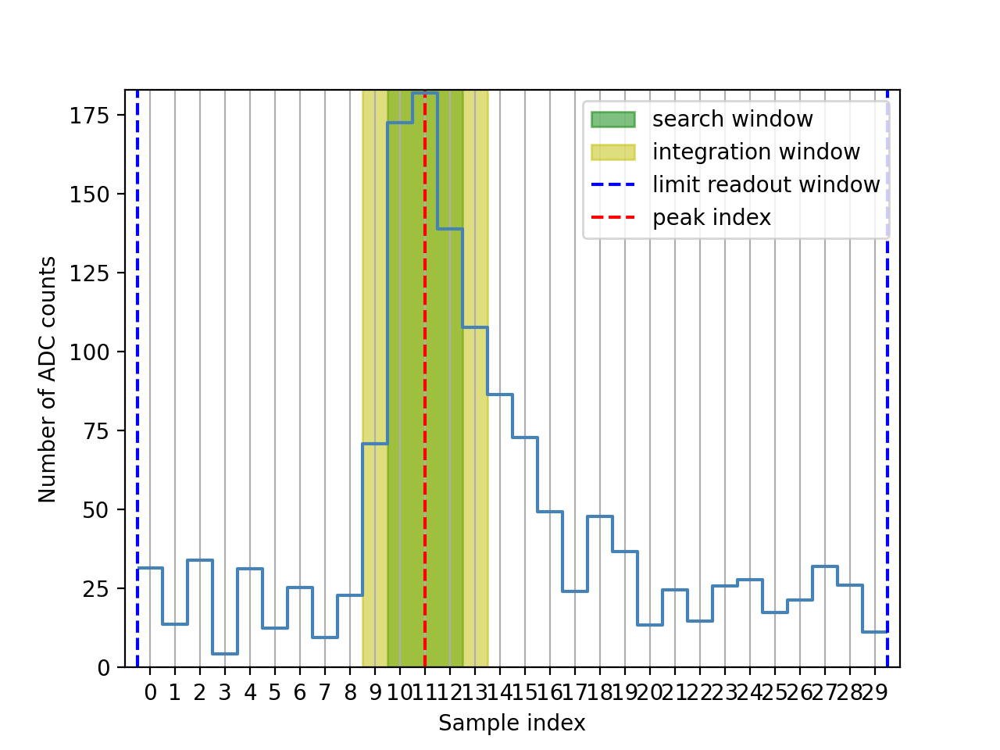

.. _image_charge_extractors:

#########################################
Image Extraction (waveform cube to image)
#########################################

.. contents::
   :depth: 1
   :local:

The main operation in the event processing from DL0 to Dl1 is the reducing of the
waveforms into per-pixel signal-summarising parameters, from which image analysis
can be performed to reconstruct the Cherenkov shower. This summary is
performed for three reasons:

* The amount of useful information is arguably a small fraction of
  the total waveform volume (across all pixels in the Cherenkov camera).

* There is typically at most one single Cherenkov signal pulse per waveform.

* It is easier to perform further image analysis techniques on 2-dimensional
  images. This is a much more common image processing situation, for which many
  standard techniques exist across data science.

This operation is performed by an `ImageExtractor`. This class summarises the
signal contained in the waveform with two parameters:

* The signal's charge

* The position (time) of the signal with the waveform.

************************
Image Extraction Methods
************************

The field of signal processing is very widespread, and many common
techniques are applicable to the waveforms from Cherenkov cameras. The large
range of options is therefore reflected in the design of the `ImageExtractor`
in *ctapipe*. `ImageExtractor` itself is an abstract class. Subclasses of
`ImageExtractor` define the approach for extracting the charge and the time.
Typical extraction techniques involve two stages:

* Peak finding, to identify the most probable location for the signal

* Integration, to extract the charge with a window that is large enough to
  capture the signal, but small enough that it minimises the amount of noise
  (e.g. Night Sky Background, electronic...) included.

However, an `ImageExtractor` is not forced to conform to these stages, and is
free to utilise any information from the camera description (such as reference
pulse shape or neighbouring pixels).

The most important criteria in selecting and configuring an `ImageExtractor` is
the Charge/Intensity Resolution - how well the extracted charge matches the true
charge. The best `ImageExtractor` for one camera type may not be the same for
another.

See below for the currently existing `ImageExtractor` classes.

***********************
Units and Normalisation
***********************

An `ImageExtractor` should preserve the units of the waveform samples when
extracting the charge. I.e. if the samples are already calibrated into
photoelectrons, then the charge reported by the `ImageExtractor` should be in
photoelectrons. The simple `ImageExtractors` (e.g. `LocalPeakWindowSum`)
achieve this with the `integration_correction` method, which scales the summed
samples to account for the percentage of the pulse missed by the the window.
This way, if a single photoelectron exists in the waveform (and no noise) then
the result of the `ImageExtractor` will equal 1, no matter the window size.

The extracted pulse time is corrected for the waveform sampling rate to be
provided in units of nanoseconds.

********
Examples
********

TwoPassWindowSum
----------------

Example of 1st pass integration:

.. automodapi:: ctapipe.image.extractor
