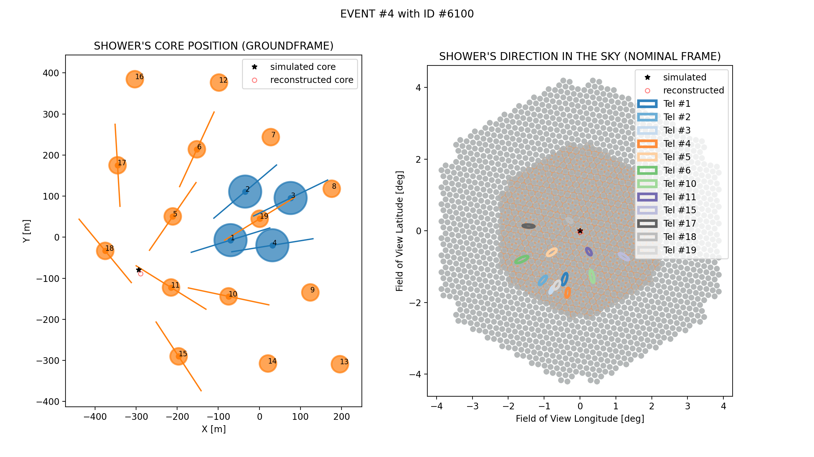
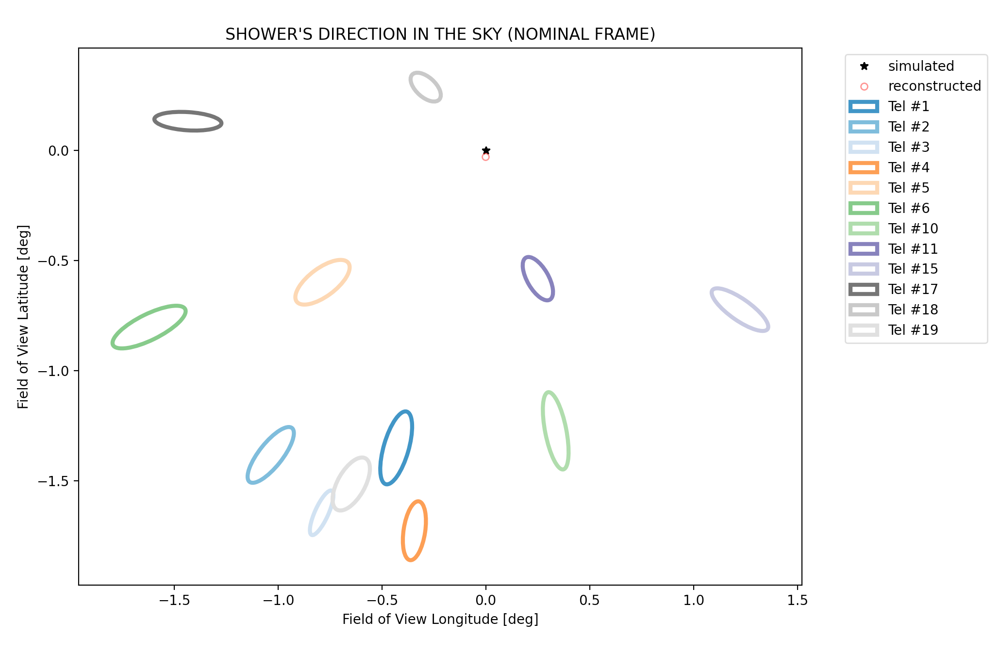

.. _reco:

================================
Reconstruction (`~ctapipe.reco`)
================================

.. currentmodule:: ctapipe.reco

Introduction
============

`ctapipe.reco` contains functions and classes to reconstruct physical
shower parameters, using either stereo (multiple images of a shower)
or mono (single telescope) information.

All shower reconstruction algorithms should be subclasses of
`~ctapipe.reco.Reconstructor` which defines some common functionality.

Currently Implemented Algorithms
================================

Moment-Based Stereo Reconstruction
----------------------------------

Moment-base reconstruction uses the moments of each shower image (the
*Hillas Parameters* to estimate the shower axis for each camera, and
combines them geometrically to estimate the true shower direction.

The implementation is in the `~ctapipe.reco.HillasReconstructor` class.

The following 2 pictures have been produced using the example script
`stereo_reconstruction_core_and_direction.py`

  Shower's core and direction in the sky.
  Pixels positions are shown in comparison with Hillas ellipses.

  Same event, but showing only the ellipses.

Template-Based Stereo Reconstruction
------------------------------------

Moment-base reconstruction uses the a fit of the full camera images to an expected
image model to find the best fit shower axis, energy and depth of maximum.
The implementation is in the `~ctapipe.reco.ImPACTReconstructor` class.

.. toctree::
    ImPACT

Reference/API
=============

.. automodapi:: ctapipe.reco
.. automodapi:: ctapipe.reco.hillas_intersection
.. automodapi:: ctapipe.reco.hillas_reconstructor
.. automodapi:: ctapipe.reco.impact
.. automodapi:: ctapipe.reco.reco_algorithms
