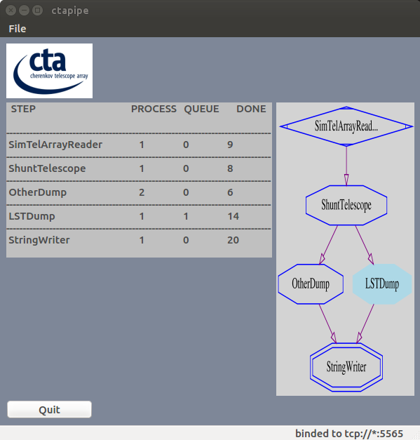

.. _flow:

=============================
Flow-based framework (`flow`)
=============================

.. currentmodule:: ctapipe.flow

Introduction
============

`ctapipe.flow`
is a Python implementation of the flow-based programming paradigm.
In flow-based programming, applications are defined as networks of black-box components
that exchange data across predefined connections.
These components can be reconnected to form different applications.
ctapipe-flow executes ctapipe processing modules in a sequantial or multiprocess environment.
User implements steps in Python class.

The multiprocess mode is based on ZeroMQ library (http:queue//zeromq.org) for messages passing between process.
ZMQ library allows to stay away from class concurrency mechanisms like mutexes,
critical sections semaphores, while being thread safe.
Passing data between steps is managed by the router thanks to Pickle serialization.
A Step can be executed by several process, in this case the router uses LRU pattern (least recently used ) to
choose the step that will receive next data. The router also manage Queue for each step.

    python ctapipe/flow/gui/guiflow.py  application. It displays a complete flow based framework  instance containing:
    A producer step (SimTelArrayReader) that reads events in a SimTelArray MC file and sends them one by one to next step.
    A stager step (ShuntTelescope) that receives event and guides it to the next step according to it type (LST or other)
    A stager step (LSTDump) that receives LST telescope raw data, and sends a string with LST tag and raw data string representation.
    A stager step (OtherDump) that receives OTHER telescope raw data, and sends a string with OTHER tag and raw data string representation.
    This step runs on 2 processes (this is represented by 2 arrows)
    A consumer step (StringWriter) that receives strings and writes them to a file.

Getting Started
===============
ZMQ library installation
------------------------
   *prompt$> conda install pyzmq*

flow based framework configuration
==================================
flow based framework configuration is read from a json configuration file, or command line arguments, thanks to traitlets config.

Mandatories configuration entries:
----------------------------------

- One producer_conf containing 1 step.

- One consumer_conf containing 1 step.

- One stagers_conf containing 1 to n step(s).

Mandatory configuration per step
--------------------------------
- name  : step name

- class : class name containing algorithm

- module: python module containing class (defined above)

- next_steps: list of next steps (you should use comma to separate items)

Optional general entries:
- zmq_port: By default zmq used port from 5555 to 5600. You can change it in configuration json filees.
i.e: "zmq_ports" :  [6001,6002,6004,6005],

Optional entry per step
^^^^^^^^^^^^^^^^^^^^^^^
- nb_process:  only available for stage, not for producer or consumer. Define how many process will execute this stage
- queue_limit:  Define maximum number of message a router can queue for this step. Used it to limit memery consumption.

User option for step
^^^^^^^^^^^^^^^^^^^^
If step class derived form Component, you can add all required parameters for the step, and get them at execution time.
You have to add a new entry with step's class name.
! Do not use entries in stagers_conf, producer_conf or consumer_conf

json example
^^^^^^^^^^^^
.. code-block:: json

    {
      "version": 1,
      "Flow": {
          "producer_conf": { "name" : "SimTelArrayReader", "module": "ctapipe.flow.algorithms.simtelarray_reader",
               "class": "SimTelArrayReader","next_steps" : "ShuntTelescope"},
          "consumer_conf": { "name" : "StringWriter", "module": "ctapipe.flow.algorithms.string_writer",
                    "class": "StringWriter"},
          "stagers_conf" : [ {"name": "ShuntTelescope", "class": "ShuntTelescope",
                                          "module": "ctapipe.flow.algorithms.shunt_telescope",
                                          "next_steps" : "OtherDump,LSTDump" },
                            {"name": "OtherDump", "class": "OtherDump",
                                          "module": "ctapipe.flow.algorithms.other_dump",
                                          "next_steps" : "StringWriter", "nb_process" : 2},
                            {"name": "LSTDump", "class": "LSTDump",
                                          "module": "ctapipe.flow.algorithms.lst_dump",
                                          "next_steps" : "StringWriter", "nb_process" : 1, "queue_limit" : 10}
                          ]
      },
      "SimTelArrayReader": { "filename": "gamma_test.simtel.gz"},
      "StringWriter": { "filename": "/tmp/string_writter.txt"}
    }

Steps implementation
====================
Step is defined in a Python class. Each class defines 3 methods: init, run and finish
These 3 methods are executed by the flow based framework .

Producer run method
-------------------
Producer class run method does not have any input parameter.
Use yeld to send data to next step. If there are several steps linked to it, yield
the result in a tuple with the name of next step as last tuple value.
i.e.: yield((result,'PAIR'))

.. code-block:: python

    >>> def run(self):
    >>>     for input_file in os.listdir(self.source_dir):
    >>>         yield (self.source_dir + "/" + input_file)

Stager run method
-----------------
Stager class run method takes one parameter (sent by the previous step).
Use return or yield to send data to next step.If there are several steps linked to it, return or yield
the result in a tuple with the name of next step as last tuple value.
i.e.: yield((result,'StringWriter'))

.. code-block:: python

    >>> def run(self,event):
    >>>     if event != None:
    >>>         return(event.dl0.tels_with_data)

In case of a step has to send several output for one input to the next step :

.. code-block:: python

    >>> def run(self,event):
    >>>    if event != None:
    >>>        tels = event.dl0.tels_with_data
    >>>        for tel in tels:
    >>>             yield(tel)

Consumer run method
-------------------
Consumer class run method takes one parameter and does not return anything

Send message with several next steps.
-------------------------------------
In case of producer or stage have got several next step (next_steps keyword in configuration),
you can choose the step that will receive data by passing its name as last tuple value with the result:
i.e return((res1,res2),'NEXT_STEP_NAME').
If the last tuple value is not a available next_step (from configuration), the full tuple is send to
the default next_step.

.. code-block:: python

    >>> def run(self,event):
    >>>    if event != None:
    >>>        tels = event.dl0.tels_with_data
    >>>        for tel in tels:
    >>>             if tel in lst_list:
    >>>                 yield(tel,'LST_CALIBRATION')
    >>>             elif tel in mst_list
    >>>                 yield(tel,'MST_CALIBRATION')

The `connections` member variable can be used by Producers and stagers in their `run()`
member method to get the list of connections names.
For instance, to broadcast an event to all linked stagers:

.. code-block:: python

    >>> def run(self, event):
    >>>    if event != None:
    >>>        for connection in self.connections:
    >>>            yield event, connection

Running the ctapipe-flow
========================

   *prompt$> ctapipe-flow --config=mypipeconfig.json*

By default it will run the flow based framework in sequential mode.
Use `--mode=multiprocess` to run it in a multiprocess mode.
By default it does not send any data to gui. To activate data transmition to gui,
add `--gui=True` option.
flow based framework  send its activity to a GUI  on tcp://localhost:5565.
But if the GUI is running on another system, you can use --gui_address
option to define another address.
Configure the firewall to allow access to that port for authorized computers.

Execution examples
------------------
    *prompt$> ctapipe-flow --config=examples/flow/flow_py/example.json*

flow based framework end
========================
In multiprocess mode ,the main challenge is how to stop all Threads without loosing an inputs.
Indeed, we must ensure that all queues are empty and all processed are waiting for a new entry (not active).
Because Python Process can not be paused, we can not check that all the queues are empty and at the same time check that all processes are inactive
So there is a risk that a queue is filled again when we control state of process.
the choosen solution is:
1 check that all queues are empty.
2 check that all processes are waiting for a new job since more that a definied time (5 seconds by default)

Graphical representation
========================
A GUI can be launch to keep a close watch on flow based framework  execution.
This GUI can be launch on the same system than the flow based framework  or on a different one.
By default GUI is binded to port 5565. You can change it with `--PipeGui.port` option

    *prompt$> python ctapipe/flow/gui/guiflow.py*

Optional packages for GUI
-------------------------

PyQt4 installation
^^^^^^^^^^^^^^^^^^
    *prompt$> conda install pyqt*

graphviz installation
^^^^^^^^^^^^^^^^^^^^^
    *prompt$> pip install graphviz*

Foreseen improvement
====================

On demand recomputing
---------------------
Lazy evaluation of function, by storing the results to the disk,
and not rerunning the function twice for the same arguments.

Working  data in shared memory (memmaping)
------------------------------------------
To avoid to serialize and deserialize data and pass data thanks to ZMQ,
 a shared memory system can be develop between stages.

Muliple flow based framework management by GUI
----------------------------------------------
When several flow based framework are running, GUI should allows to choose which flow based framework user want to follow.

Issues
======
Command ctapipe-flow --help-all, does not display traitlets parameters for classes
derived from ctapipe.core.Component, used as Producer, Stager or Consumer.
This is because ctapipe-flow instantiates theses classes after Flow.__init__() method.
Anyway, theses traitlets parameters are take into account by these classes.

Examples
========

json configuration example
--------------------------
Refer to `json example`_.

.. _example:

Producer example
----------------
.. code-block:: python

    from ctapipe.utils.datasets import get_path
    from ctapipe.io.hessio import hessio_event_source
    from ctapipe.core import Component
    from traitlets import Unicode

    class SimTelArrayReader(Component):

        """`SimTelArrayReader` class represents a Producer for flow based framework.
            It opens simtelarray file and yiekld even in run method
        """
        filename = Unicode('gamma', help='simtel MC input file').tag(
            config=True, allow_none=True)
        source = None

        def init(self):
            self.log.info("--- SimTelArrayReader init {}---".format(self.filename))
            try:
                in_file = get_path(self.filename)
                self.source = hessio_event_source(in_file)
                self.log.info('{} successfully opened {}'.format(self.filename,self.source))
            except:
                self.log.error('could not open ' + in_file)
                return False
            return True

        def run(self):
            counter = 0
            for event in self.source:
                event.dl0.event_id = counter
                counter += 1
                # send new job to next step thanks to router
                yield(event)
            self.log.info("\n--- SimTelArrayReader Done ---")

        def finish(self):
            self.log.info("--- SimTelArrayReader finish ---")
            pass

Stager example
--------------
.. code-block:: python

    from ctapipe.utils.datasets import get_path
    import ctapipe.instrument.InstrumentDescription as ID
    from ctapipe.core import Component
    from traitlets import Unicode

    LST=1
    OTHER = 2
    class ShuntTelescope(Component):
        """ShuntTelescope class represents a Stage for flow based framework.
            It shunts event based on telescope type
        """

        def init(self):
            self.log.info("--- ShuntTelescope init ---")
            self.telescope_types=dict()
            for index in range(50):
                self.telescope_types[index]=LST
            for index in range(50,200,1):
                self.telescope_types[index]=OTHER
            return True

        def run(self, event):
            triggered_telescopes = event.dl0.tels_with_data
            for telescope_id in triggered_telescopes:
            if self.telescope_types[telescope_id] == LST:
                return(event.dl0.tel[telescope_id],'LSTDump')
            if self.telescope_types[telescope_id] == OTHER:
                return(event.dl0.tel[telescope_id],'OtherDump')

        def finish(self):
            self.log.info("--- ShuntTelescope finish ---")
            pass

Consumer example
----------------
.. code-block:: python

    from ctapipe.configuration.core import Configuration, ConfigurationException
    from ctapipe.core import Component

    class StringWriter(Component):

            def init(self):
                filename = '/tmp/test.txt'
                self.file = open(filename, 'w')
                self.log.info("--- StringWriter init ---")
                return True

            def run(self, object):
                if (object != None):
                    self.file.write(str(object) + "\n")

            def finish(self):
                self.log.info("--- StringWriter finish ---")
                self.file.close()
