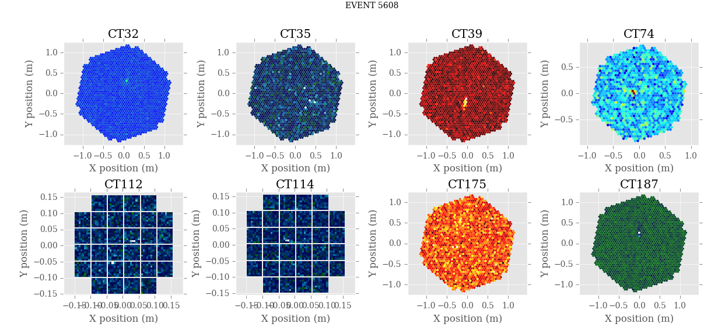

.. include:: references.txt

.. _ctapipe:

=====================================================
 CTA Experimental Pipeline Framework (:mod:`ctapipe`)
=====================================================

.. currentmodule:: ctapipe

**version**:  |version|

What is ctapipe?
================

`ctapipe` is an experimental framework for the data processing
pipelines for CTA.

.. CAUTION::
   This is not yet stable code, so expect large and rapid changes to
   structure and functionality as we explore various design choices.

* Code, feature requests, bug reports, pull requests: https://github.com/cta-observatory/ctapipe
* Docs: https://cta-observatory.github.io/ctapipe/
* License: BSD-3
* Python 3.4 or later (Python 2 is not supported)

.. _ctapipe_docs:

General documentation
=====================

.. toctree::
  :maxdepth: 1
  :glob:

  getting_started/index
  development/index
  tools/index
  */index
  FAQ
  bibliography
  changelog

Module API Status (relative to next release)
============================================

* **stable** = should not change drastically in next release
* **caution** = mostly stable, but expect some changes
* **unstable** = expect large changes and avoid heavy reliance
* **experimental** = stable feature, but under evaluation
* **deprecated** = do not use

================  ===============
 Module           Status
================  ===============
`analysis`        **stable**
`calib`           **stable**
`coordinates`     caution
`core`            **stable**
`flow`            experimental
`instrument`      **stable**
`plotting`        caution
`reco`            **stable**
`utils`           **stable**
`visualization`   **stable**
================  ===============

Authors (as of 2017-10-11)
==========================
(computed from the list of GIT commits)

- Karl Kosack
- Jason Watson
- Dan Parsons
- Jacquemier
- Tino Michael
- Maximilian Nöthe
- Christoph Deil
- Alison Mitchell
- justuszorn
- Samuel Timothy Spencer
- AMWMitchell
- Raquel de los Reyes
- Michele Mastropietro
- Jeremie DECOCK
- Kai Brügge
- tino-michael
- Abelardo Moralejo Olaizola
- Markus Gaug
- tialis
- fvisconti
- Wrijupan Bhattacharyya
- bultako
- Paolo Cumani
- Tristan Carel
- Michael Punch
- Miguel Nievas
- Orel Gueta
- Tarek Hassan
- Daniel Parsons
- GernotMaier
- David Landriu
- labsaha
- Pierre Aubert

Development Help
================

* Development workflow examples from AstroPy: http://astropy.readthedocs.org/en/latest/development/workflow/development_workflow.html
* GIT tutorial: https://www.atlassian.com/git/tutorials/syncing/git-pull
* Code distribution and Packaging https://packaging.python.org/en/latest/
