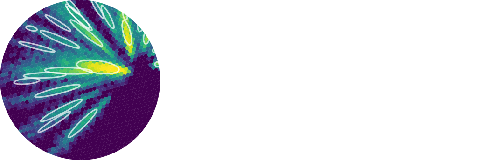

.. include:: references.txt

:html_theme.sidebar_secondary.remove: true

.. _ctapipe:

==============================================
Prototype CTA Pipeline Framework (``ctapipe``)
==============================================

.. currentmodule:: ctapipe

**Version**:  |version|

.. image:: ctapipe_logo.webp
   :class: only-light
   :align: center
   :width: 90%
   :alt: The ctapipe logo.

What is ctapipe?
================

``ctapipe`` is a framework for prototyping the low-level data processing algorithms for the Cherenkov Telescope Array.

.. CAUTION::
   This is not yet stable code, so expect large and rapid changes to
   structure and functionality as we explore various design choices before
   the 1.0 release.

* Code, feature requests, bug reports, pull requests: https://github.com/cta-observatory/ctapipe
* Docs: https://ctapipe.readthedocs.io/
* License: BSD-3
* Python: |python_requires|

.. _ctapipe_docs:

.. General documentation
.. =====================

.. toctree::
  :maxdepth: 1
  :hidden:

  User Guide <getting_started_users/index>
  Developer Guide <getting_started/index>
  ctapipe_api/index
  development/index
  tutorials/index
  examples/index
  tools/index
  FAQ
  data_models/index
  bibliography
  changelog

.. grid:: 3

    .. grid-item-card::

        :octicon:`book;40px`
        
        User Guide
        ^^^^^^^^^^

        Learn how to get started as a user. This guide
        will help you install ctapipe.

        +++

        .. button-ref:: getting_started_users/index
            :expand:
            :color: primary
            :click-parent:

            To the user guide

    .. grid-item-card::

        :octicon:`person-add;40px`
        
        Developer Guide
        ^^^^^^^^^^^^^^^

        Learn how to get started as a developer.
        This guide will help you install ctapipe for development
        and explains how to contribute.

        +++

        .. button-ref:: getting_started/index
            :expand:
            :color: primary
            :click-parent:

            To the developer guide

    
    .. grid-item-card::

        :octicon:`git-pull-request;40px`

        Development Guidelines
        ^^^^^^^^^^^^^^^^^^^^^^

        These guidelines explain the coding style and the workflow. The ctapipe
        enhancement proposals (CEPs) can also be found here.

        +++

        .. button-ref:: development/index
            :expand:
            :color: primary
            :click-parent:

            To the development guidelines

    .. grid-item-card::
        
        :octicon:`code;40px`

        API Docs
        ^^^^^^^^

        The API docs contain detailed descriptions of
        of the various modules and functions included
        in ctapipe.

        +++

        .. button-ref:: ctapipe_api/index
            :expand:
            :color: primary
            :click-parent:

            To API docs

    .. grid-item-card::

        :octicon:`mortar-board;40px`
        
        Tutorials
        ^^^^^^^^^

        A collection of tutorials aimed at new users
        and developers to familiarize with ctapipe.

        +++

        .. button-ref:: tutorials/index
            :expand:
            :color: primary
            :click-parent:

            To the tutorials

    .. grid-item-card::

        :octicon:`light-bulb;40px`

        Examples
        ^^^^^^^^

        Some lower-level examples of features included in the ctapipe API.

        +++

        .. button-ref:: examples/index
            :expand:
            :color: primary
            :click-parent:

            To the examples

Module API Status (relative to next release)
============================================

ctapipe is under activate developement and we will make breaking changes from release to release until
we reach version 1.0.

Development Help
================

* Development workflow examples from AstroPy: https://astropy.readthedocs.org/en/latest/development/workflow/development_workflow.html
* GIT tutorial: https://www.atlassian.com/git/tutorials/syncing/git-pull
* Code distribution and Packaging https://packaging.python.org/en/latest/

