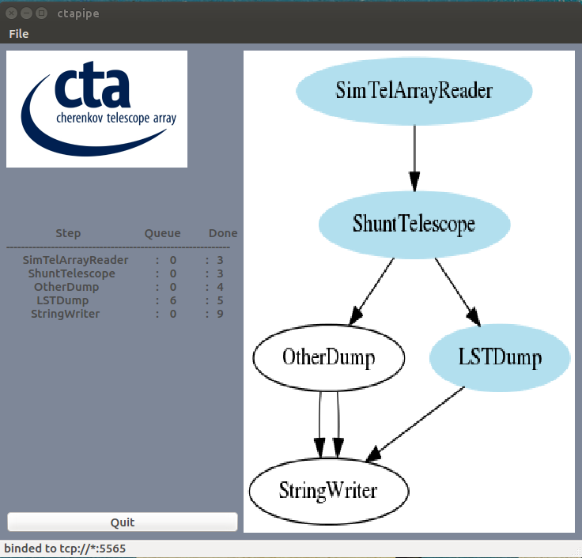

.. _pipeline:

================
Pipeline
================

.. currentmodule:: ctapipe.pipeline

Introduction
============

`ctapipe.pipeline`
is a module for distributing computations (ctapipe Tools) for parallel execution in a multithread environment.

It is based on ZeroMQ library (http://zeromq.org) for message passing between threads.
ZMQ library allows to stay away from class concurrency mechanisms like mutexes,
critical sections semaphores, while being thread safe.

User defined steps thanks to Python classes. Passing data between steps is managed by the router.
If a step is executed by several threads, the router uses LRU pattern (least recently used ) to
choose the step that will receive next data. The router also manage Queue for each step.

    A complete pipeline instance containing:- A producer step, a calibration step running on two threads, an Hillas step running on four threads and a consumer step.
    Oval shapes represent router elements.

Getting Started
===============
Pipeline configuration
----------------------
Pipeline configuration is read from a json configuration file, or command line arguments, thanks to traitlets config.

Mandatories configuration entries:
^^^^^^^^^^^^^^^^^^^^^^^^^^^^^^^^^^

- One producer_conf containing 1 step.

- One consumer_conf containing 1 step.

- One stagers_conf containing 1 to n step(s). Step are executed in the same order as the defined list (stagers_conf).

Mandatory configuration per step
^^^^^^^^^^^^^^^^^^^^^^^^^^^^^^^^
- name  : step name

- class : class name containing algorithm

- module: python module containing class (defined above)

Optional entry per step
^^^^^^^^^^^^^^^^^^^^^^^
- nb_thread (only available for stage, not for producer or consumer). Define how many thread will execute this stage

User option for step
^^^^^^^^^^^^^^^^^^^^
You can add all needed parameters for the stage, and get them at executation time.

configuration example
^^^^^^^^^^^^^^^^^^^^^
.. code-block:: json

     {
       "version": 1,
       "Pipeline": {
          "producer_conf": { "name" : "EVENT_READER", "module": "ctapipe.pipeline.algorithms.fake_producer", "class": "FakeProducer"},
          "consumer_conf": { "name" : "SAVER", "module": "ctapipe.pipeline.algorithms.fake_process2", "class": "FakeProcess2"},
          "stagers_conf" : [{"name" : "CLEANING", "class": "FakeProcess", "module": "ctapipe.pipeline.algorithms.fake_process", "nb_thread" : 2},
                            {"name" : "HILLAS", "class": "FakeProcess", "module": "ctapipe.pipeline.algorithms.fake_process", "nb_thread" : 2}]
       }
     }

Steps implementation
---------------------
Step is defined in a Python class. Each class defines 3 methods: init, run and finish
These 3 methods are executed by the pipeline.

Producer run method
^^^^^^^^^^^^^^^^^^^
Producer class run method does not have any input parameter and must yield a result (! not return), as a Python generator.

.. code-block:: python

    >>> def run(self):
    >>>     for input_file in os.listdir(self.source_dir):
    >>>         yield self.source_dir + "/" + input_file

Stager run method
^^^^^^^^^^^^^^^^^
Stager class run method takes one parameter (sending by previous step).
It can return nothing or one value per input or yield several values per input.

.. code-block:: python

    >>> def run(self,event):
    >>>     if event != None:
    >>>         return event.dl0.tels_with_data
or if step have to send several output to its next step for one input.

.. code-block:: python

    >>> def run(self,event):
    >>>    if event != None:
    >>>        tels = event.dl0.tels_with_data
    >>>        for tel in tels:
    >>>            yield tel

Consumer run method
^^^^^^^^^^^^^^^^^^^
Consumer class run method takes one parameter and does not return anything

Running the pipeline
--------------------
   %prompt> ctapipe-pipeline --config=mypipeconfig.json
By defalut pipeline send is activity to a GUI on tcp://localhost:5565.
But if GUI is running on another system, you can used --Pipeline.gui_address option
to defined another address

Pipeline Graphical representation
=================================
A GUI can be launch to keep a close watch on pipeline executation.
This GUI can be launch on the same system than the pipeline or on a different one.
By default GUI is binded to port 5565. You can change it with --PipeGui.port option
    %prompt> ctapipe-guipipe 

Foressen improvement:
=====================
- limit router queue if request by user.
- passing message to any pipeline step (not only the next one).

Pipeline example
^^^^^^^^^^^^^^^^
json configuration example
--------------------------
.. code-block:: json

    {
      "version": 1,
      "Pipeline": {
          "producer_conf": { "name" : "HESSIO_READER", "module": "ctapipe.pipeline.algorithms.hessio_reader",
               "class": "HessioReader"},
          "consumer_conf": { "name" : "WRITER", "module": "ctapipe.pipeline.algorithms.string_writer",
                    "class": "StringWriter"},
          "stagers_conf" : [{"name": "LIST_TEL", "class": "ListTelda", "module": "ctapipe.pipeline.algorithms.list_teldata", "nb_thread" : 2}]

      }
    }

Producer example
^^^^^^^^^^^^^^^^
.. code-block:: python

    from ctapipe.utils.datasets import get_path
    from ctapipe.io.hessio import hessio_event_source
    from ctapipe.configuration.core import Configuration, ConfigurationException
    import threading
    from sys import stderr

    class HessioReader():

        def __init__(self,configuration=None):
            self.configuration = configuration

        def init(self):
            print("--- HessioReader init ---")
            return True

        def run(self):
            try:
                filename = get_path('gamma_test.simtel.gz')
                source = hessio_event_source(filename,max_events=10)
            except(RuntimeError):
                print("could not open gamma_test.simtel.gz", file=stderr)
                return False
            for event in source:
                # send new job to next step thanks to router
                yield event
            print("\n--- HessioReader Done ---")

        def finish(self):
            print ( "--- HessReader finish ---")
            pass

Stager example
^^^^^^^^^^^^^^
.. code-block:: python

    from time import sleep
    import threading

    class ListTelda():
        def __init__(self,configuration=None):
            self.configuration = configuration

        def init(self):
            print("--- ListTelda init ---")

        def run(self,event):
            if event != None:
           	    res = list(event.dl0.tels_with_data)
                return res

        def finish(self):
            print("--- ListTelda finish ---")

Consumer example
^^^^^^^^^^^^^^^^
.. code-block:: python

    from ctapipe.configuration.core import Configuration, ConfigurationException

    class StringWriter:
            def __init__(self,configuration=None):
                self.conf = configuration

            def init(self):
                filename = '/tmp/test.txt'
                self.file = open(filename, 'w')
                print("--- StringWriter init ---")
                return True

        def run(self,object):
            if ( object != None):
                #print("--- Writer object ---")
                self.file.write(str(object)+"\n")

        def finish(self):
            print("--- StringWriter finish ---")
            self.file.close()

Execution examples
^^^^^^^^^^^^^^^^^^
    ctapipe-pipeline --config=examples/brainstorm/pipeline/pipeline_py/example.json
