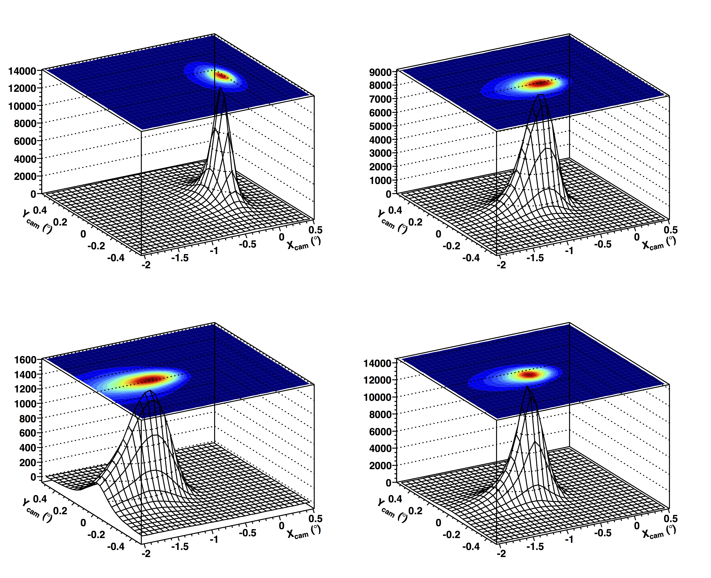
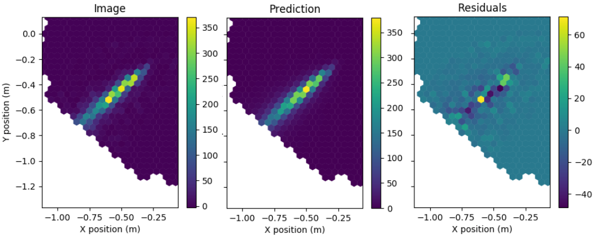
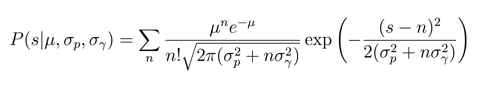

.. _ImPACT:

Analysis with ImPACT
==================================

.. currentmodule:: ctapipe.reco.ImPACT

What is ImPACT?
---------------------

ImPACT stands for **Image Pixel-wise fit for Atmospheric Cherenkov Telescopes**, it is
an event reconstruction algorithm originally created for the H.E.S.S. experiment. This
reconstruction algorithm uses the full camera image to perform a fit of the shower axis
and nergy, thereby extracting the maximum possible performance of the instrument.

Image Templates
++++++++++++++++++++++

The first step of the analysis is to generate a library of image templates for all
possible shower energies, impact distances and depth of maximum. There templates are
essentially the expected images from a "perfect" and extremely finely pixelated camera,
generated for all possible observing conditions of the shower. Currently these
templates are created by performing a full Monte Carlo air shower simulations, followed
by ray tracing of the created Cherenkov photons to the camera focal plane. For more
details as to how this is performed check the paper (link).

The above figure shows 4 examples of the image templates, created in the nominal system
(X-Y axis in degrees), with the Z-axis showing the expected number of photo-electrons.

Image Prediction
++++++++++++++++++++++

Once the template library has been generated it can then be used to create a predicted
gamma-ray image by interpolating between the template available in the library.
Currently this interpolation is performed in the energy, impact distance and Xmax
dimensions, however in the future it is likely that azimuth and altitude dimensions will
be added to this. Interpolation is performed using the `~ctapipe.utils.TableInterpolator`
class.

Calculating Image Likelihood
++++++++++++++++++++++++++++

Once a prediction of the image expectation can be made it should be compared to the
data to assess the likelihood that the model represents the data. Several likelihood
functions have been formulated, however currently the ImPACT code uses the likelihood
function formulated in

This likelihood of a signal s given an expectation of μ consists of a convolution of the
Poisson distribution of each individual photo- electron n, with the resolution of the
photosensor. Where the resolution of the photosensor is represented by a Gaussian of
width  sqrt(σ2 + nσ2) , where pγ σp is the width of the pedestal (charge distribution from
night sky background light and electronic noise) and σγ is the width of the single
photoelectron distribution.

Once this per pixel likelihood function has been defined it can be simply summed over all
significant pixels, selected based on the two level tail cut described in, with two (or
more) additional rows of pixels added around the image edge, and summed over all
telescopes passing selection cuts to find an event likelihood for a given set of
shower parameters.

Maximum Likelihood Fitting
++++++++++++++++++++++++++

This event likelihood must then be minimised in a 6-dimensional fit over direction,
impact point, Xmax and primary energy. In order to simplify the reconstruction of Xmax
it is first reconstructed using a geometrical approach, assuming depth of maximum
corresponds to the brightest point in the image (calculated by taking the average position
of the brightest 3 camera pixels). The minimisation can then be performed over a
modification factor to the estimated Xmax, greatly reducing the time taken for the fit
procedure.

Fitting is performed using the `~iminuit` package (a wrapper around the MINUIT minimiser),
providing a fast and reliable minimisation. The algorithm finds a function minimum in
the majority of cases, typically taking around 500 function calls to reach the minimum.

Performance
++++++++++++++++++++++

Coming soon...?

Running an ImPACT analysis
--------------------------

Simple pseudocode example of using ImPACT is shown below. Full example will be added to
examples directory soon.

.. code-block:: python

   def reconstruct_ImPACT():

        source = hessio_event_source(filename)
        impact = ImPACTReconstructor(minimiser="minuit")
        for event in source:

            # Perform a regular Hillas reconstruction here
            impact.set_event_properties(image, # Dictionary of camera image amplitudes
                                        pixel_x, pixel_y, # Dictionary of camera pixel
                                                          # positions
                                        pixel_area, # Dictionary of camera pixel areas
                                        type_tel, # Dictionary of telescope types
                                        tel_x, tel_y, # Dictionary of telescope positions
                                        array_direction,# HorizonSystem object
                                        hillas) # Dictionary of Hillas parameters

If you wish to run an ImPACT analysis outside of the standard 'ImPACTReconstruction'
script then some setup must be performed to get the analysis running. Firstly the
ImPACT reconstruction class must be initialised (this takes some time so should be done
outside the event loop).

Once the class has been initialised the properties of the event must then be passed on
to the ImPACT class. This can be performed using the
`~ctapipe.reco.ImPACTReconstructor.set_event_properties`
function.  In order to perform the reconstruction one must pass to the ImPACT code the
pixel positions in the nominal system, pixel areas (in angular units), the telescope
types, telescope positions in the ground system system, the pointing direction of the
array and the hillas parameters of the telescope images.

Once the event properties have been passed the event reconstruction can be performed by
simply calling the `~ctapipe.reco.ImPACTReconstructor.predict` function and
providing a seed shower direction and energy.

Choosing you minimiser
++++++++++++++++++++++

When initialising the ImPACT reconstructor (see
`~ctapipe.reco.ImPACTReconstructor`), one can choose the minimiser to be used in the
reconstruction. Although "minuit" is defined as the default option and should currently
be used for performance estimation other minimisers can be selected for testing
purposes.

Any of the minimiser names listed for `~scipy.optimize.minimize` or
`~scipy.optimize.least_squares` can be used. For example "bfgs" or "lm" can be used to
select the scipy BFGS or Levenberg-Marquart minimisers respectively.

